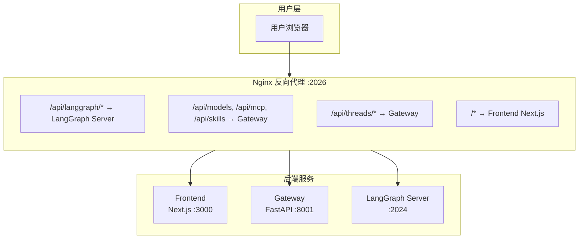

# DeerFlow的后端和前端是如何交互的？

DeerFlow 前后端交互的完整说明：

## 架构概览



## API 分为两类

### 1. LangGraph API (`/api/langgraph/*`)

用于 Agent 交互、线程管理和流式响应：

| 端点                                                    | 功能         |
| ----------------------------------------------------- | ---------- |
| `POST /api/langgraph/threads`                         | 创建会话线程     |
| `GET /api/langgraph/threads/{thread_id}/state`        | 获取线程状态     |
| `POST /api/langgraph/threads/{thread_id}/runs`        | 执行 Agent   |
| `POST /api/langgraph/threads/{thread_id}/runs/stream` | 流式执行 Agent |

### 2. Gateway API (`/api/*`)

用于模型配置、MCP、技能、文件上传等：

| 端点                                              | 功能        |
| ----------------------------------------------- | --------- |
| `GET /api/models`                               | 获取可用模型列表  |
| `GET /api/mcp/config`                           | 获取 MCP 配置 |
| `PUT /api/mcp/config`                           | 更新 MCP 配置 |
| `GET /api/skills`                               | 获取技能列表    |
| `POST /api/skills/{name}/enable`                | 启用技能      |
| `POST /api/threads/{thread_id}/uploads`         | 上传文件      |
| `GET /api/threads/{thread_id}/artifacts/{path}` | 获取生成的文件   |

## 前端如何连接后端

前端使用 **LangGraph SDK** 客户端，配置在 [api-client.ts](file:///Users/lzc/TNTprojectZ/deer-flow/frontend/src/core/api/api-client.ts)：

```typescript
import { Client as LangGraphClient } from "@langchain/langgraph-sdk/client";

const client = new LangGraphClient({
  apiUrl: getLangGraphBaseURL(isMock),  // 默认为 /api/langgraph
});
```

URL 配置通过环境变量（见 [config/index.ts](file:///Users/lzc/TNTprojectZ/deer-flow/frontend/src/core/config/index.ts)）：

```bash
# 可选，默认使用 nginx 代理
NEXT_PUBLIC_BACKEND_BASE_URL="http://localhost:8001"
NEXT_PUBLIC_LANGGRAPH_BASE_URL="http://localhost:2024"
```

## 流式响应

前端使用 **Server-Sent Events (SSE)** 接收流式响应，支持的流模式在 [stream-mode.ts](file:///Users/lzc/TNTprojectZ/deer-flow/frontend/src/core/api/stream-mode.ts) 中定义：

```typescript
const SUPPORTED_RUN_STREAM_MODES = [
  "values",
  "messages",
  "messages-tuple",
  "updates",
  "events",
  "debug",
  "tasks",
  "checkpoints",
  "custom",
];
```

## API 文档位置

完整的 API 文档在 **[backend/docs/API.md](file:///Users/lzc/TNTprojectZ/deer-flow/backend/docs/API.md)**，包含：

- 所有端点的详细说明
- 请求/响应示例
- 错误处理
- SDK 使用示例（Python/JavaScript/cURL）

另外，Gateway API 还提供了在线文档：

- **Swagger UI**: `http://localhost:2026/docs`
- **ReDoc**: `http://localhost:2026/redoc`
- **OpenAPI Schema**: `http://localhost:2026/openapi.json`

