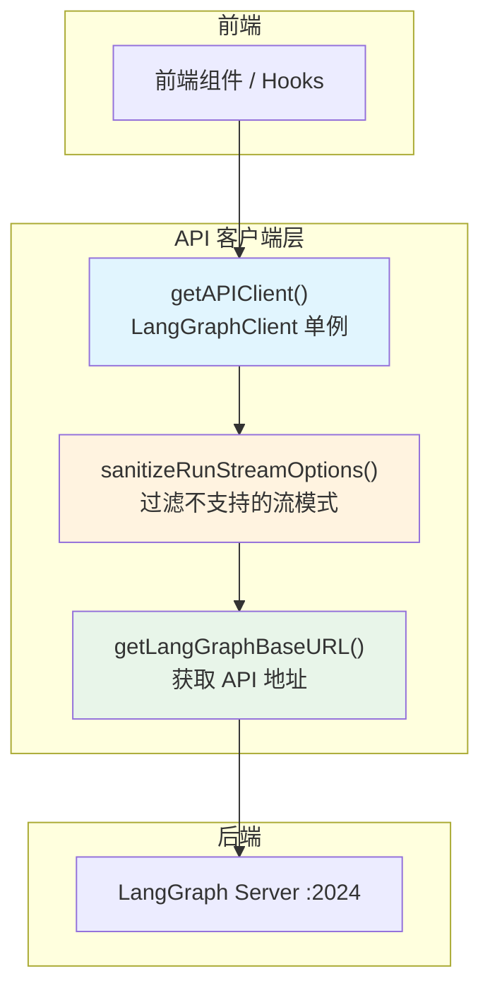

# 前端API代码总结
          
## `/frontend/src/core/api` 代码总结

该模块负责前端与后端 LangGraph API 的交互。

### 文件结构

| 文件 | 职责 |
|------|------|
| [index.ts](~/deer-flow/frontend/src/core/api/index.ts) | 导出入口 |
| [api-client.ts](~/deer-flow/frontend/src/core/api/api-client.ts) | LangGraph 客户端封装 |
| [stream-mode.ts](~/deer-flow/frontend/src/core/api/stream-mode.ts) | 流模式兼容性处理 |
| [stream-mode.test.ts](~/deer-flow/frontend/src/core/api/stream-mode.test.ts) | 单元测试 |

---

### 核心功能

#### 1. `api-client.ts` - LangGraph 客户端封装

**作用**：创建兼容的 LangGraph SDK 客户端

**关键逻辑**：
- 使用**单例模式**全局共享一个客户端实例
- 通过**猴子补丁**包装 `runs.stream` 和 `runs.joinStream` 方法
- 自动过滤不支持的流模式参数

```typescript
export function getAPIClient(isMock?: boolean): LangGraphClient {
  _singleton ??= createCompatibleClient(isMock);
  return _singleton;
}
```

#### 2. `stream-mode.ts` - 流模式兼容性处理

**作用**：确保前端请求的流模式与后端 LangGraph 服务器兼容

**支持的流模式**：
```typescript
const SUPPORTED_RUN_STREAM_MODES = new Set([
  "values",
  "messages",
  "messages-tuple",
  "updates",
  "events",
  "debug",
  "tasks",
  "checkpoints",
  "custom",
]);
```

**关键函数**：
- `warnUnsupportedStreamModes()` - 警告被丢弃的流模式（仅警告一次）
- `sanitizeRunStreamOptions()` - 过滤不支持的流模式

```typescript
export function sanitizeRunStreamOptions<T>(options: T): T {
  // 1. 检查是否有 streamMode 参数
  // 2. 过滤掉不支持的模式（如 "tools"）
  // 3. 返回清理后的参数
}
```

---

### 架构设计



---

### 关键设计模式

| 模式 | 应用 |
|------|------|
| **单例模式** | `getAPIClient()` 确保全局唯一客户端 |
| **猴子补丁** | 包装 SDK 方法，添加兼容性逻辑 |
| **装饰器模式** | `sanitizeRunStreamOptions()` 过滤参数 |