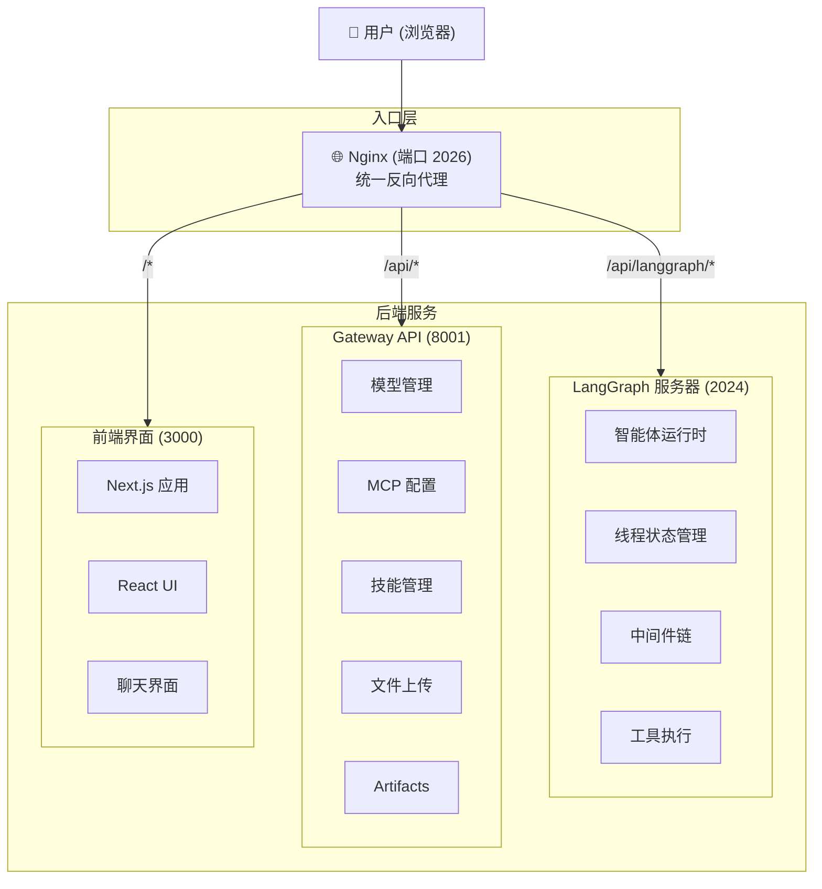
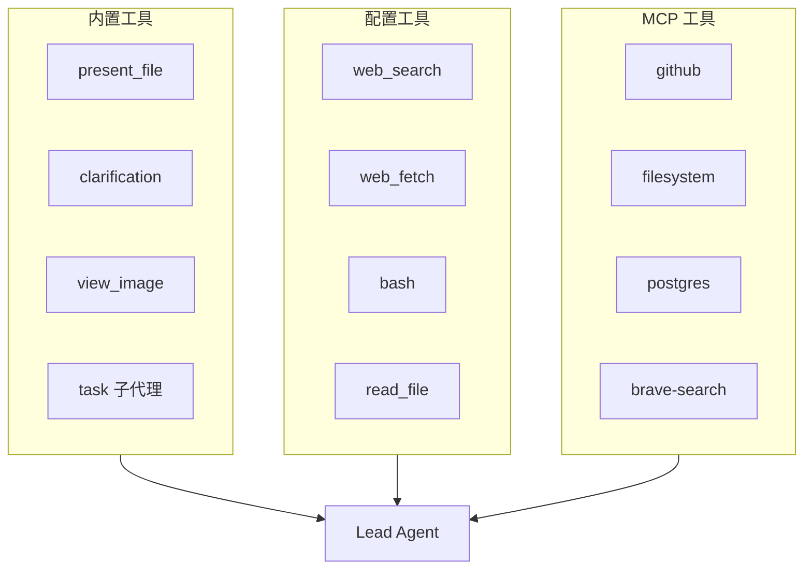

> **导语**：在 AI Agent 爆发的 2025-2026 年，如何让大模型真正"动手"而不仅仅是"动口"？ByteDance 开源的 DeerFlow 项目给出了一个优雅的答案——通过编排子智能体、记忆系统和沙箱执行，打造属于你的超级智能体中枢。

***

## 📖 第一部分：入门篇——认识 DeerFlow

### 什么是 DeerFlow？

DeerFlow（**D**eep **E**xploration and **E**fficient **R**esearch **Flow**）是一个开源的**超级智能体中枢（Super Agent Harness）**。简单来说，它像一个"AI 操作系统"，能够：

- 🤖 **指挥多个子智能体**并行工作
- 🧠 **记住你的偏好和上下文**，跨对话保持连续性
- 💻 **在隔离沙箱中执行代码**，安全地操作文件、运行命令
- 🔌 **通过技能系统无限扩展**能力边界
- 🌐 **连接各种外部工具**（MCP 协议、Web 搜索、数据库等）

DeerFlow 2.0 发布后迅速登顶 GitHub Trending，成为了 AI Agent 领域最受关注的项目之一。

### 为什么需要 DeerFlow？

想象一下这个场景：

> 你想分析一份财报 PDF，生成可视化图表，写一篇分析文章，最后做成 PPT。

**传统方式**：你需要手动操作多个工具，花几个小时甚至几天。

**使用 DeerFlow**：只需一条指令，它会自动：

1. 调用子智能体 A 读取并理解 PDF 内容
2. 调用子智能体 B 用 Python 生成数据图表
3. 调用子智能体 C 撰写分析文章
4. 调用子智能体 D 制作 PPT
5. 把所有成果整理好交给你

**核心优势**：

- ✅ **多任务并行**：不再是单线程对话，而是多智能体协作
- ✅ **长期记忆**：记住你的工作习惯、偏好和上下文
- ✅ **安全执行**：所有代码在隔离的 Docker 容器中运行
- ✅ **可扩展**：通过技能系统，今天不会的技能明天就能学会

### 快速开始：5 分钟部署

#### 第一步：克隆项目

```bash
git clone https://github.com/bytedance/deer-flow.git
cd deer-flow
```

#### 第二步：配置模型

编辑项目根目录的 `config.yaml` 文件。这里以 **ModelScope** 为例（国内用户友好，注册即送每日 2000 免费额度）：

```yaml
models:
  - name: Qwen3.5-122B-A10B          # 内部标识名
    display_name: Qwen3.5 通义千问     # 显示名称
    use: langchain_qwq:ChatQwQ       # LangChain 集成包
    model: Qwen/Qwen3.5-122B-A10B    # ModelScope 模型 ID
    api_base: https://api-inference.modelscope.cn/v1
    api_key: $MODELSCOPE_API_KEY     # 环境变量引用
    max_tokens: 65536                # 输出 token 上限
    temperature: 1.0                 # 创造性参数（0-2）
    top_p: 0.95                      # 核采样参数
    presence_penalty: 1.5            # 话题多样性
    extra_body:
      top_k: 20
      min_p: 0.0
      repetition_penalty: 1.0
    supports_vision: true            # 启用视觉能力（支持 view_image 工具）
```

> 💡 **提示**：以上参数参考了 ModelScope 官方推荐配置，可根据实际需求调整。

**安装依赖**：

编辑 `backend/packages/harness/pyproject.toml`，添加：

```toml
[project]
dependencies = [
    "langchain-qwq>=0.3.4",  # ModelScope Qwen 系列模型支持
]
```

然后运行：

```bash
cd backend
uv sync  # 或 pip install -e .
```

> 🌐 **其他模型配置示例**：
> - **OpenAI**: 使用 `langchain_openai:ChatOpenAI` + `api_base: https://api.openai.com/v1`
> - **Claude**: 使用 `langchain_anthropic:ChatAnthropic`
> - **Gemini**: 使用 `langchain_google_vertexai:ChatVertexAI`
> - **本地模型**: 使用 Ollama、vLLM 等 + OpenAI 兼容接口

#### 第三步：设置 API Key

在项目根目录创建 `.env` 文件（或复制 `.env.example`）：

```bash
# ModelScope API Key（必选）
MODELSCOPE_API_KEY=your-modelscope-api-key

# Tavily API Key（用于网络搜索，可选但推荐）
TAVILY_API_KEY=your-tavily-api-key

# 其他服务密钥（按需添加）
# OPENAI_API_KEY=sk-...
# ANTHROPIC_API_KEY=sk-ant-...
```

> 🔐 **安全提示**：`.env` 文件已自动加入 `.gitignore`，不会被提交到代码库。

#### 第四步：一键启动

```bash
make docker-start  # 使用 Docker（推荐）
# 或
make dev  # 本地开发模式
```

访问 <http://localhost:2026>，你就可以开始和 DeerFlow 对话了！

### 核心功能一览

#### 1️⃣ **技能系统（Skills）**

技能是 DeerFlow 的"超能力包"。每个技能包含：

- 特定的工具组合
- 专用的提示词模板
- 领域知识和工作流程

**内置技能示例**：

- 📊 `data-analysis`：数据分析与可视化
- 🎨 `frontend-design`：前端页面设计
- 📝 `deep-research`：深度网络研究
- 📽️ `video-generation`：视频生成
- 📊 `ppt-generation`：PPT 制作

**使用方式**：

```
"帮我用 deep-research 技能研究一下量子计算的最新进展"
```

#### 2️⃣ **子智能体（Sub-Agents）**

DeerFlow 可以将复杂任务分解给多个专用子智能体：

| 子智能体              | 专长           |
| ----------------- | ------------ |
| `general-purpose` | 通用任务，拥有完整工具集 |
| `bash`            | 命令行专家，擅长系统操作 |

**并发执行**：每次最多 3 个子智能体并行工作，15 分钟超时保护。

#### 3️⃣ **沙箱系统（Sandbox）**

所有代码执行都在隔离环境中进行：

- **本地模式**：直接在主机运行（开发用）
- **Docker 模式**：每个对话一个独立容器（生产用）
- **K8s 模式**：通过 Kubernetes 编排（大规模部署）

**虚拟路径映射**：

```
/mnt/user-data/workspace → 你的工作目录
/mnt/user-data/uploads   → 上传的文件
/mnt/user-data/outputs   → 生成的成果
/mnt/skills              → 技能库
```

#### 4️⃣ **长期记忆（Memory）**

DeerFlow 会自动从对话中提取：

- 👤 **用户上下文**：工作、兴趣、当前关注点
- 📚 **事实知识**：带置信度评分的结构化事实
- ⚙️ **偏好设置**：你的习惯和喜好

下次对话时，这些记忆会自动注入，让 AI 更懂你。

***

## 🚀 第二部分：进阶篇——深入 DeerFlow 架构

### 架构全景图



**请求路由**（通过 Nginx）：

- `/api/langgraph/*` → LangGraph 服务器 - 智能体交互、线程管理、流式响应
- `/api/*`（其他）→ Gateway API - 模型、MCP、技能、记忆、文件上传
- `/`（非 API）→ 前端界面 - Next.js 应用

### 核心组件深度解析

#### 1. **Lead Agent：智能体的"大脑"**

`Lead Agent` 是整个系统的入口，由 LangChain 的 `create_agent` 创建。它的核心职责：

```python
# 简化版伪代码
def make_lead_agent(config):
    agent = create_agent(
        model=create_chat_model(),      # 动态模型选择
        tools=all_tools,                # 所有可用工具
        middleware=middleware_chain,    # 9 层中间件
        system_prompt=build_prompt(),   # 系统提示词
    )
    return agent
```

**关键特性**：

- 🎯 **动态模型路由**：支持同时配置多个模型（GPT-4、Gemini、Claude 等）
- 🧩 **中间件链**：9 个中间件按严格顺序执行，处理跨领域关注点
- 🛠️ **工具融合**：内置工具 + MCP 工具 + 社区工具统一调度
- 📝 **提示词工程**：技能注入、记忆上下文、工作目录引导

#### 2. **中间件链：9 层过滤网**

每个请求都要经过 9 层中间件处理：

| 顺序 | 中间件                       | 作用          |
| - | ------------------------- | ----------- |
| 1  | `ThreadDataMiddleware`    | 创建线程隔离的工作目录 |
| 2  | `UploadsMiddleware`       | 注入上传文件到上下文  |
| 3  | `SandboxMiddleware`       | 获取沙箱环境      |
| 4  | `SummarizationMiddleware` | 上下文过长时自动摘要  |
| 5  | `TodoListMiddleware`      | 计划模式下跟踪任务   |
| 6  | `TitleMiddleware`         | 自动生成对话标题    |
| 7  | `MemoryMiddleware`        | 将对话加入记忆队列   |
| 8  | `ViewImageMiddleware`     | 为视觉模型注入图像数据 |
| 9  | `ClarificationMiddleware` | 拦截澄清请求并中断执行 |

**设计哲学**：每层中间件只负责一个关注点，像洋葱一样包裹核心逻辑。

#### 3. **工具生态系统**

DeerFlow 的工具来源分为 3 类：



**工具对比**：

| 类别         | 工具示例                                                  | 用途        |
| ---------- | ----------------------------------------------------- | --------- |
| **内置工具**   | `present_file`, `clarification`, `view_image`, `task` | 核心交互功能    |
| **配置工具**   | `web_search`, `web_fetch`, `bash`, `read_file`        | 网络搜索、文件操作 |
| **MCP 工具** | `github`, `filesystem`, `postgres`, `brave-search`    | 外部服务集成    |

**MCP（Model Context Protocol）集成**：

- 支持 `stdio`、`SSE`、`HTTP` 三种传输方式
- 内置 OAuth 2.0 认证（客户端凭证、刷新令牌）
- 工具自动发现，无需手动注册

#### 4. **沙箱架构：安全与隔离**

沙箱是 DeerFlow 的"执行引擎"，采用抽象工厂模式：

```python
# 抽象接口
class SandboxProvider:
    def acquire(self) -> Sandbox
    def release(self, sandbox: Sandbox)

# 具体实现
class LocalSandboxProvider(SandboxProvider)   # 本地执行
class AioSandboxProvider(SandboxProvider)    # Docker 容器
```

**虚拟路径翻译**：

```python
# 用户看到的虚拟路径
/mnt/user-data/workspace/file.txt

# 实际物理路径
backend/.deer-flow/threads/{thread_id}/user-data/workspace/file.txt
```

这样做的好处：

- ✅ 不同线程完全隔离
- ✅ 技能路径统一映射到 `/mnt/skills`
- ✅ 支持嵌套容器路径保留

#### 5. **记忆系统：让 AI 记住你**

记忆系统的工作流程：

```
对话 → 提取上下文 → 结构化存储 → 置信度评分 → 下次对话注入
```

**存储结构**：

```json
{
  "user_context": {
    "work": "AI 研究员",
    "personal": "喜欢摄影",
    "top_of_mind": "正在研究多模态模型"
  },
  "facts": [
    {"content": "用户偏好使用 Python", "confidence": 0.95},
    {"content": "用户在字节跳动工作", "confidence": 0.87}
  ]
}
```

**注入机制**：

- 按置信度降序排列
- 限制最大 token 数（默认 2000）
- 使用 `tiktoken` 精确计数

### 高级特性

#### 1. **InfoQuest 集成**

DeerFlow 集成了字节跳动的智能搜索工具 InfoQuest：

- 📡 支持免费试用（通过 BytePlus）
- 🔍 比传统搜索更智能的抓取能力
- 🌐 批量网页内容提取

#### 2. **Python 嵌入式客户端**

无需启动服务器，直接在 Python 代码中使用 DeerFlow：

```python
from deerflow.client import DeerFlowClient

client = DeerFlowClient(
    checkpointer=MemorySaver(),  # 支持多轮对话
    model_name="gpt-4o",
    thinking_enabled=True,
    subagent_enabled=True,
)

# 流式响应
for event in client.stream("分析这份财报"):
    print(event.type, event.data)

# 配置查询
print(client.list_models())
print(client.list_skills())
```

#### 3. **IM 渠道集成**

支持飞书、Slack、Telegram：

- **飞书**：实时流式更新卡片
- **Slack/Telegram**：等待完成后回复

### 性能优化实践

#### 1. **上下文工程**

当对话接近 token 限制时，自动触发摘要：

```yaml
summarization:
  enabled: true
  trigger: ["human", "ai"]  # 人类或 AI 消息触发
  keep: ["system", "human:2", "ai:2"]  # 保留最近 2 轮
```

#### 2. **子智能体并发控制**

```python
# 最大并发数：3
# 超时时间：15 分钟
# 状态追踪：后台线程池 + SSE 事件
```

#### 3. **记忆更新去重**

- 批量更新减少 LLM 调用
- 基于 mtime 的缓存失效
- 置信度低于阈值的事实自动丢弃

### 实战案例：从 0 到 1 构建数据分析应用

#### 场景

用户上传一份销售数据 Excel，要求：

1. 分析销售趋势
2. 生成可视化图表
3. 创建交互式 Dashboard

#### DeerFlow 执行流程

```
1. 用户上传文件 → UploadsMiddleware 处理
2. Lead Agent 接收请求
3. 调用 task() 工具创建子智能体 A（数据分析）
4. 子智能体 A：
   - 读取 Excel 文件
   - 用 pandas 分析趋势
   - 调用子智能体 B（可视化）
5. 子智能体 B：
   - 用 matplotlib 生成图表
   - 用 plotly 创建交互式图表
6. 调用子智能体 C（前端）：
   - 创建 HTML Dashboard
   - 集成所有图表
7. 返回成果目录给用户
```

**代码示例**（技能定义）：

```markdown
---
name: data-analysis
description: 专业数据分析技能，包含完整的数据处理、统计分析和可视化流程
---

# 数据分析技能

## 工作流程

1. **数据加载**
   - 读取 CSV/Excel 文件
   - 数据清洗和预处理

2. **探索性分析**
   - 描述性统计
   - 相关性分析
   - 异常值检测

3. **可视化**
   - 趋势图（折线图）
   - 分布图（直方图、箱线图）
   - 关系图（散点图、热力图）

4. **报告生成**
   - Markdown 总结
   - 关键发现
   - 建议措施
```

### 未来展望

DeerFlow 2.0 已经是一个功能强大的超级智能体中枢，但进化仍在继续：

**路线图亮点**：

- 🔮 **TF-IDF 上下文感知检索**：基于当前对话内容智能召回记忆
- 🎯 **加权排序**：相似度 + 置信度综合排名
- 🌍 **更多 IM 渠道**：微信、Discord 等
- 📦 **技能市场**：社区贡献技能一键安装
- 🔐 **企业级权限**：RBAC 访问控制

***

## 🎯 结语

DeerFlow 代表了一种新的 AI 应用范式：**不是单个强大的模型，而是精心编排的智能体生态系统**。

通过子智能体分工协作、长期记忆保持连续性、沙箱确保安全执行、技能系统无限扩展——DeerFlow 让大模型从"聊天机器人"进化为真正的"数字员工"。

**无论你是**：

- 👨‍💻 开发者：想要构建自己的 AI 应用
- 📊 数据分析师：希望自动化重复工作
- 🎨 创作者：需要 AI 辅助内容生产
- 🏢 企业：寻求 AI 转型方案

DeerFlow 都提供了一个开箱即用的起点。现在就开始你的超级智能体之旅吧！

***

**资源链接**：

- 📦 GitHub: <https://github.com/bytedance/deer-flow>
- 🌐 官网：<https://deerflow.tech>
- 📚 文档：<https://github.com/bytedance/deer-flow/tree/main/backend/docs>

***

